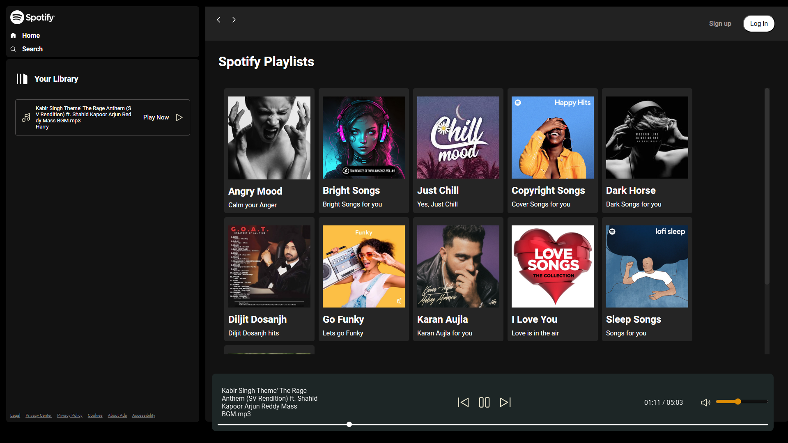

# Spotify Clone

A feature-rich clone of the Spotify web player built using **HTML**, **CSS**, and **JavaScript**. This project demonstrates a combination of frontend skills to replicate the design, functionality, and interactivity of Spotify's user interface.

## Features

- **Dynamic UI**: Replicates the visual design and layout of the Spotify web player.
- **Interactivity**: Basic functionality implemented using JavaScript for a dynamic user experience.
- **Responsive Design**: Optimized for multiple devices, ensuring seamless usability on desktops, tablets, and mobile phones.
- **Custom Styling**: Styled with CSS to achieve pixel-perfect similarity to Spotify's interface.

## Technologies Used

- **HTML**: Structure and content of the website.
- **CSS**: Styling and layout using Flexbox and Grid.
- **JavaScript**: Added interactivity and dynamic behavior.

## How to Use

1. Clone the repository:
   ```bash
   git clone https://github.com/myselfdeb/Spotify-Clone.git
2. Open the project directory:
   ```bash
   cd Spotify-Clone
3. Open the index.html file in your favorite browser:
   ```bash
   Open with browser
4. Explore the design and interactivity of the Spotify clone.

## Screenshots
### Desktop View


## Future Enhancements
- Integrate a backend for dynamic content loading.

## Contributing
- Feel free to fork this repository and share improvements or ideas. Contributions are always welcome!

### **GitHub Repository Description**
**"Spotify Clone**: A dynamic clone of the Spotify web player built using HTML, CSS, and JavaScript. Features include a responsive design and interactive elements showcasing frontend development skills. Explore the project [here](https://github.com/myselfdeb/Spotify-Clone/tree/main)."  

Let me know if you’d like further customization! 😊


